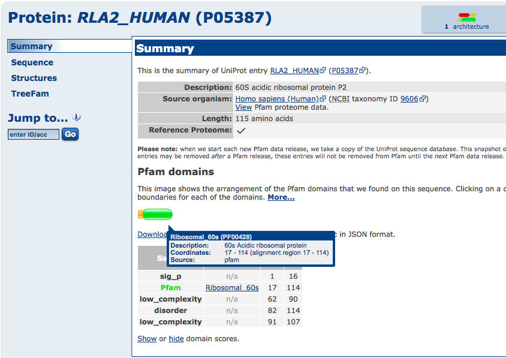
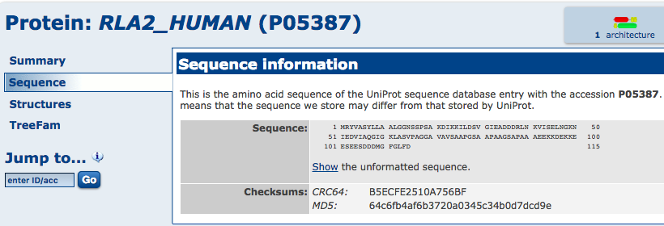
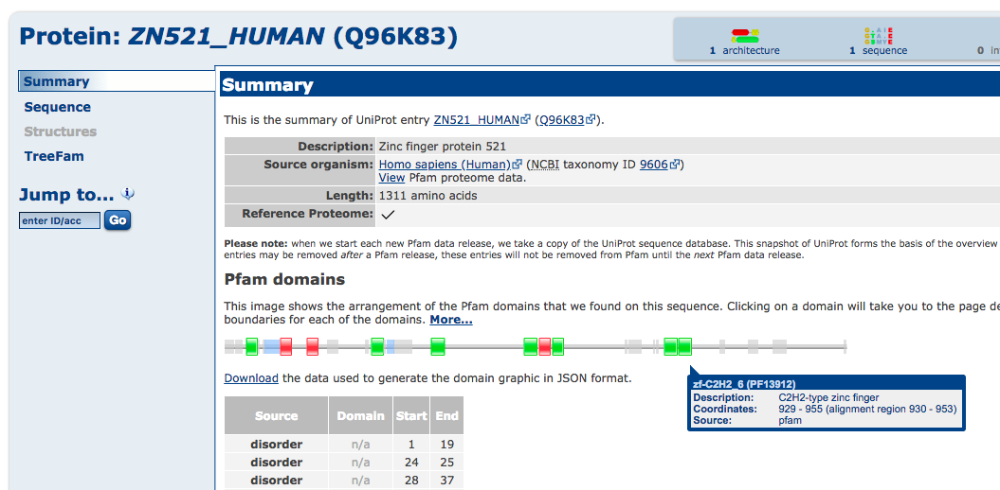
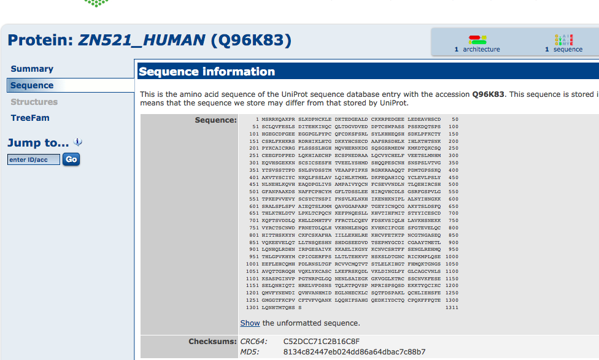
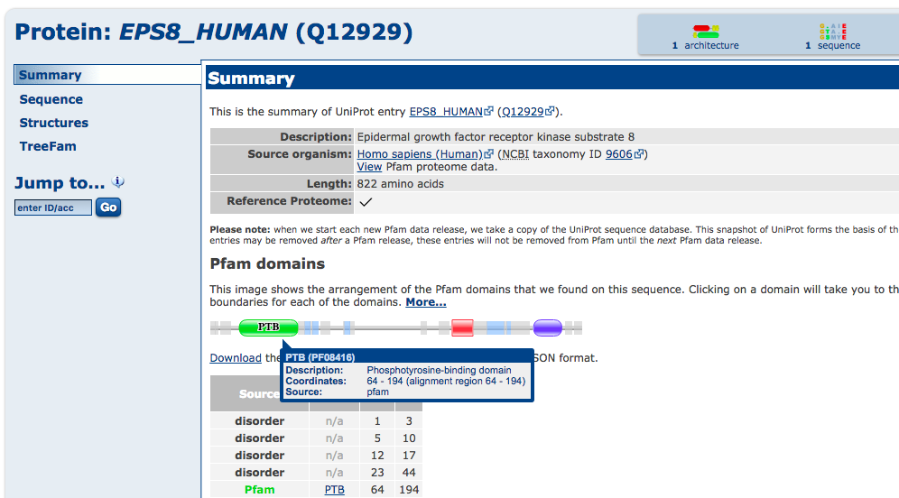
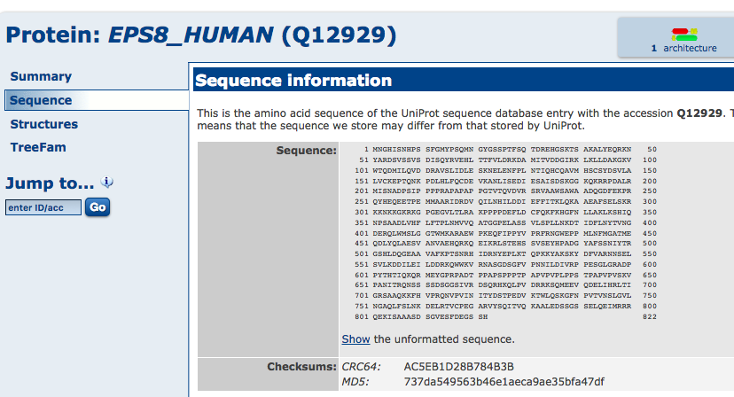
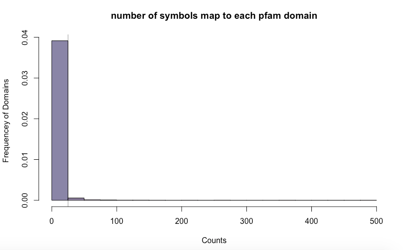
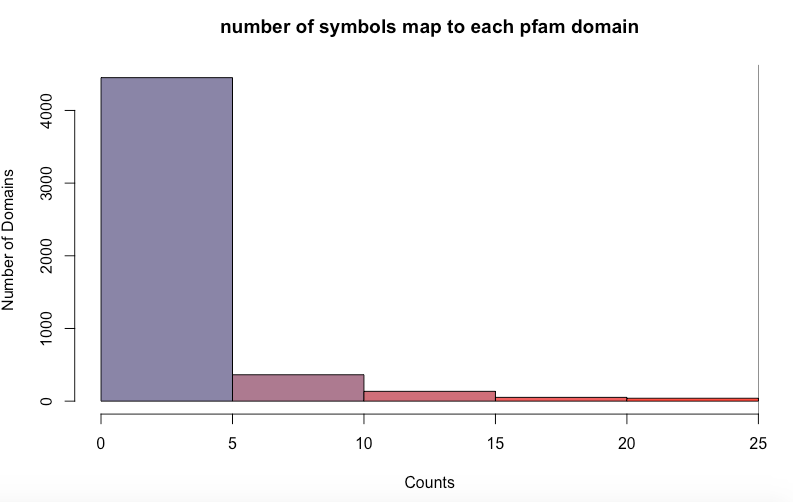
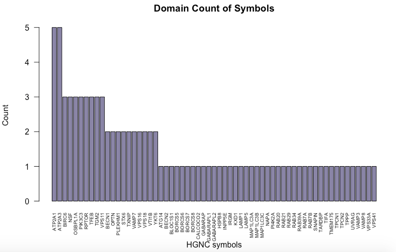
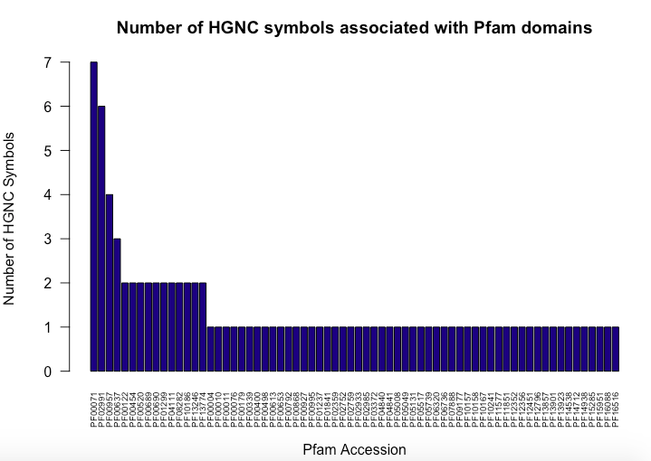

# `BCB420.2019.Pfam`

#### (Pfam data annotatation of human genes)

&nbsp;


###### [Tina Lee](https://orcid.org/0000-0002-4802-9588), University of Toronto, Canada. &lt;yijen.lee@mail.utoronto.ca&gt;

----

## 1 About this package:

This package describes the workflow to download pfam families data from the [Pfam database](https://pfam.xfam.org/), how to map HGNC symbols to pfam domains, how to annotate the example gene set , and provides examples of computing database statistics.

The package serves dual duty, as an Rstudio project, as well as an R package that can be installed. Package checks pass, without errors, warnings, or notes.

&nbsp;

#### In this project ...

```text
 --BCB420.2019.STRING/
   |__.gitignore
   |__.Rbuildignore
   |__BCB420.2019.Pfam.Rproj
   |__DESCRIPTION
   |__dev/
      |__rptTwee.R
      |__toBrowser.R               # display .md files in your browser
   |__inst/
      |__extdata/
         |__sym2enst.RData         # ENSP ID to HGNC symbol mapping tool
      |__img/
         |__[...]                  # image sources for .md document
      |__scripts/
         |__recoverIDs.R           # utility to use biomaRt for ID mapping
   |__LICENSE
   |__NAMESPACE
   |__R/
      |__zzz.R
   |__README.md                    # this file

```

&nbsp;

----

## 2 Pfam Data

Proteins are generally comprised of one or more functional regions, known as protein domains. The presence of different domains in varying combinations in different proteins give rise to the diverse repertoire of proteins found in nature. Identifying the domains present in a protein can provide insights into the function  of that protein.

&nbsp;

#### 2.1 Data semantics

Pfam is a database of curated protein families, which each is defined by two alignments and a profile hidden Markov model (HMM) using the HMMER software. The profile HMM is then searched against sequence databases, with all matches scoring greater than a certain threshold being considered as true members. Then these members are aligned to the profile HMM to generate full alignment.

Related Pfam entries are grouped into clans, the relationship is determined by similarity of sequence, structure or HHM.

Pfam data are available in a variety of formats, which includes flatfiles and relational table dumps, both of which can be downloaded from the FTP website. In addition, the Pfam website provides different ways to access the database content, providing both graphical representations of and interactive access to the data. 

Pfam is now primarily based on the UniProtKB reference proteomes, which greatly reduces the counts of matched sequences and species reported on the website restricted to this smaller set.

&nbsp;

## 3 Data download and cleanup
To download the source data from Pfam ... :

1. Navigate to the [**Ensembl**](http://useast.ensembl.org/index.html) and follow the link to the [BioMart](http://useast.ensembl.org/biomart/martview/b13049612725fd3cd2d8e840477651f0).
2. Choose "Ensembl Genes 95" as database and "Human genes (GRCh38.p2)" as dataset.
3. Select Filters -> Expand Protein Domains and Families -> Limit genes to ... select "With Pfam domain ID(s)"
4. Select Attributes -> Expand Gene section -> Select APPRIS annotation, Gene Stable ID, and Transcript Stable ID 
5. Expand External References -> Select HGNC symbols
6. Expand Protein Domains and Families -> Select Pfam domain ID, Pfam start, Pfam end
7. Click "Results" button in top left corner
8. "Export all results to ..." -> Select "Compressed file (.gz)" and "TSV". Press "Go"
9. Save downloaded file in sister directory "data"

* `mart_export.txt.gz` (1.5 Mb)	;

&nbsp;

Also download Pfam domain description via Pfam website.

1.  Navigate to [**Pfam**](https://pfam.xfam.org/)
2.  Click on the [FTP]() link at the top, which will direct you to the FTP server
3.  Click into current releases
4.  Download Pfam-A.clains.tvs.gz and save it in sister directory data

* `Pfam-A.clans.tsv.gz` (332 KB) ;

&nbsp;

## 4 Mapping HGNC symbols to Pfam domain IDs

Pfam domains have their own unique IDs and these could be map to HGNC Symbols. However,

&nbsp;

#### Preparations: packages, functions, files

To begin, we need to make sure the required packages are installed:

**`readr`** provides functions to read data which are particularly suitable for
large datasets. They are much faster than the built-in read.csv() etc. But caution: these functions return "tibbles", not data frames. ([Know the difference](https://cran.r-project.org/web/packages/tibble/vignettes/tibble.html).)
```R
if (! requireNamespace("readr")) {
  install.packages("readr")
}
```

&nbsp;

**`biomaRt`** biomaRt is a Bioconductor package that implements the RESTful API of biomart,
the annotation framwork for model organism genomes at the EBI. It is a Bioconductor package, and as such it needs to be loaded via the **`BiocManager`**,
&nbsp;

```R
if (! requireNamespace("BiocManager", quietly = TRUE)) {
  install.packages("BiocManager")
}
if (! requireNamespace("biomaRt", quietly = TRUE)) {
  BiocManager::install("biomaRt")
}
```

&nbsp;

**`dplyr`** is a convenient package to transform and summarize tabular data with rows and columns. It contains a set of functions that perform common data manipulation operations such as filtering roles, re-ordering rows and summarizing data.;

```R
if (! requireNamespace("dplyr")) {
  install.packages("dplyr")
}
library(dplyr)
```

&nbsp;

Finally we fetch the HGNC reference data from GitHub. (Nb. This shows how to load `.RData` files directly from a GitHub repository!)

&nbsp;

```R
myURL <- paste0("https://github.com/hyginn/",
                "BCB420-2019-resources/blob/master/HGNC.RData?raw=true")
load(url(myURL))  # loads HGNC data frame

```

&nbsp;

#### 4.1 Step 1: Which symbols do we have to map ?

&nbsp;

```R
# Load Pfam data with start and end coordinates
data <- as.data.frame(readr::read_delim(file.path("../data", "mart_export.txt"),
                          delim = "\t",
                          skip = 1,
                          col_names = c("ensembl_gene_id", "ensembl_transcript_id", "APPRIS",
                                        "pfam_domain", "pfam_start", "pfam_end", "hgnc_symbol",
                                        "uniprot_id")))
                                        
head(data)
#   ensembl_gene_id ensembl_transcript_id     APPRIS pfam_domain pfam_start pfam_end hgnc_symbol
# 1 ENSG00000198888       ENST00000361390 principal1     PF00146          6      304      MT-ND1
# 2 ENSG00000198763       ENST00000361453 principal1     PF06444        290      343      MT-ND2
# 3 ENSG00000198763       ENST00000361453 principal1     PF00361         23      284      MT-ND2
# 4 ENSG00000198804       ENST00000361624 principal1     PF00115         14      460      MT-CO1
# 5 ENSG00000198712       ENST00000361739 principal1     PF02790          1       83      MT-CO2
# 6 ENSG00000198712       ENST00000361739 principal1     PF00116         95      213      MT-CO2
#   uniprot_id
# 1     P03886
# 2     P03891
# 3     P03891
# 4     P00395
# 5     P00403
# 6     P00403

# Column ensembl_gene_id and ensembl_transcript_id are Ensembl gene and transcript IDs, column 
# APPRIS is indication whether the assocaited transcript is the principal transcript. Only 
# transcript that is "principal1" is expected to code for the main functional isoform based on the # core modules in the APPRIS database. Other transcripts ("principal2", "alternative1", etc.), are # transcripts where APPRIS core modules are unable to choose one clear principal variant. Column 
# pfam_domain, pfam_start, and pfam_end are the domain id and its start and stop coordinates. 
# Column hgnc_symbol is the HGNC symbol and column uniprot_id is the Uniprot ID.

# in our data, there is already hgnc symbols
# so we want to find a principal transcript for each symbol

# how many unique symbols do we have to map?
uHGNC <- unique(data$hgnc_symbol)

# only extract data with principal1
tmp <- data[data$APPRIS == "principal1" & data$hgnc_symbol != "", ]

# get the HGNC symbols and it's principal transcript
tmp <- na.omit(unique(tmp[, c("hgnc_symbol","ensembl_transcript_id", "pfam_domain")]))
```

&nbsp;
#### 4.2 Step 2: Check if each symbol only maps to one principal transcript

There are some symbols that have multiple principal transcripts (APPRIS=principal1). I have checked the protein sequences for these transcripts and they all get the same sequence. Therefore, we could just remove the additional transcript and keep one principal transcript.

```R

# let get the unique set of symbols and transcript
check <- unique(tmp[, c("hgnc_symbol", "ensembl_transcript_id")])

# although these symbols map to several principal transcripts, but the peptide sequences and pfam
# domains for each transcript are the same, therefore, we could just simply remove them
dup <- check[duplicated(check$hgnc_symbol), ]
dupHGNC <- dup$hgnc_symbol
dupTrans <- dup$ensembl_transcript_id

# remove those principal transcripts that is the same 
tmp <- tmp[!(tmp$hgnc_symbol %in% dupHGNC & tmp$ensembl_transcript_id %in% dupTrans),]

```

&nbsp;

#### 4.3 Step 3: Remove those symbols that map to the same ENST ID

We need to fix duplicates problem. We cannot have duplicates: we need exactly one ENST assigned to one HGNC symbol. It should be a one-to-one relationship.

&nbsp;

```R
# check if hgnc symbols map to same enst
sel <- unique(tmp[, c("hgnc_symbol", "ensembl_transcript_id")])
dupENST <- sel$ensembl_transcript_id[duplicated(sel$ensembl_transcript_id)]
sel[sel$ensembl_transcript_id %in% dupENST, ]

#       hgnc_symbol ensembl_transcript_id
# 83048     PLEKHG7       ENST00000344636
# 83050    C12orf74       ENST00000344636
# 99331      CCL3L3       ENST00000619989
# 99332      CCL3L1       ENST00000619989

# ENST00000344636 should map to C12orf74
# CCL3L1 and CCL3L3 both have Uniprot ID P16619, so we map ENST00000619989
# (arbitrarly) to CCL3L1

# remove target rows
tmp <- tmp[ ! (tmp$hgnc_symbol %in% c("C12orf74", "CCL3L3")), ]

# check result
any(duplicated(tmp$ensembl_transcript_id)) #FALSE
```

&nbsp;

#### 4.3 Validate start and stop coordinates of pfam domain IDs

Before we define the mapping tool, we to validate the coordinates of pfam domains. Make sure the sequence we fetch from bioMart is identical to the sequence that we get from Pfam website.

&nbsp;

```R
# find a protein sequence FASTA for each principal transcript
# let's just check a few transcript

# get coordinates for each transcript by merging the principal transcript we got with the original 
# data table
coor <- merge(tmp, data)

# Lets just check a few transcripts
set.seed(1234564)
samp <- sample(1:nrow(coor), 3)
coor[samp,]
#       hgnc_symbol ensembl_transcript_id pfam_domain ensembl_gene_id     APPRIS pfam_start pfam_end
# 26587       RPLP2       ENST00000530797     PF00428 ENSG00000177600 principal1         17      114
# 38010      ZNF521       ENST00000538137     PF13912 ENSG00000198795 principal1        930      954
# 9279         EPS8       ENST00000644374     PF08416 ENSG00000151491 principal1         64      194
#       uniprot_id
# 26587     P05387
# 38010     Q96K83
# 9279      Q12929

# use bioMart to find protein sequences for each principal transcript 
myMart <- biomaRt::useMart("ensembl", dataset="hsapiens_gene_ensembl")

seq <- biomaRt::getSequence(id = head(coor[samp,]$ensembl_transcript_id),
                            type = "ensembl_transcript_id",
                            seqType = "peptide",
                            mart = myMart)
                            
seq$peptide[seq$ensembl_transcript_id == "ENST00000530797"]
#[1] "MRYVASYLLAALGGNSSPSAKDIKKILDSVGIEADDDRLNKVISELNGKNIEDVIAQG
#     IGKLASVPAGGAVAVSAAPGSAAPAAGSAPAAAEEKKDEKKEESEESDDDMGFGLFD*"

```



&nbsp
```R
seq$peptide[seq$ensembl_transcript_id == "ENST00000538137"]
# [1] "MSRRKQAKPRSLKDPNCKLEDKTEDGEALDCKKRPEDGEELEDEAVHSCDSCLQVFESLSDITEHKINQCQLTDGVDVEDDPTCSWPASSPSSKDQTSP
# SHGEGCDFGEEEGGPGLPYPCQFCDKSFSRLSYLKHHEQSHSDKLPFKCTYCSRLFKHKRSRDRHIKLHTGDKKYHCSECDAAFSRSDHLKIHLKTHTSNKPYK
# CAICRRGFLSSSSLHGHMQVHERNKDGSQSGSRMEDWKMKDTQKCSQCEEGFDFPEDLQKHIAECHPECSPNEDRAALQCVYCHELFVEETSLMNHMEQVHSGE
# KKNSCSICSESFHTVEELYSHMDSHQQPESCNHSNSPSLVTVGYTSVSSTTPDSNLSVDSSTMVEAAPPIPKSRGRKRAAQQTPDMTGPSSKQAKVTYSCIYCN
# KQLFSSLAVLQIHLKTMHLDKPEQAHICQYCLEVLPSLYNLNEHLKQVHEAQDPGLIVSAMPAIVYQCNFCSEVVNDLNTLQEHIRCSHGFANPAAKDSNAFFC
# PHCYMGFLTDSSLEEHIRQVHCDLSGSRFGSPVLGTPKEPVVEVYSCSYCTNSPIFNSVLKLNKHIKENHKNIPLALNYIHNGKKSRALSPLSPVAIEQTSLKM
# MQAVGGAPARPTGEYICNQCGAKYTSLDSFQTHLKTHLDTVLPKLTCPQCNKEFPNQESLLKHVTIHFMITSTYYICESCDKQFTSVDDLQKHLLDMHTFVFFR
# CTLCQEVFDSKVSIQLHLAVKHSNEKKVYRCTSCNWDFRNETDLQLHVKHNHLENQGKVHKCIFCGESFGTEVELQCHITTHSKKYNCKFCSKAFHAIILLEKH
# LREKHCVFETKTPNCGTNGASEQVQKEEVELQTLLTNSQESHNSHDGSEEDVDTSEPMYGCDICGAAYTMETLLQNHQLRDHNIRPGESAIVKKKAELIKGNYK
# CNVCSRTFFSENGLREHMQTHLGPVKHYMCPICGERFPSLLTLTEHKVTHSKSLDTGNCRICKMPLQSEEEFLEHCQMHPDLRNSLTGFRCVVCMQTVTSTLEL
# KIHGTFHMQKTGNGSAVQTTGRGQHVQKLYKCASCLKEFRSKQDLVKLDINGLPYGLCAGCVNLSKSASPGINVPPGTNRPGLGQNENLSAIEGKGKVGGLKTR
# CSSCNVKFESESELQNHIQTIHRELVPDSNSTQLKTPQVSPMPRISPSQSDEKKTYQCIKCQMVFYNEWDIQVHVANHMIDEGLNHECKLCSQTFDSPAKLQCH
# LIEHSFEGMGGTFKCPVCFTVFVQANKLQQHIFSAHGQEDKIYDCTQCPQKFFFQTELQNHTMTQHSS*"
```



&nbsp;
```R
seq$peptide[seq$ensembl_transcript_id == "ENST00000644374"]
# [1] "MNGHISNHPSSFGMYPSQMNGYGSSPTFSQTDREHGSKTSAKALYEQRKNYARDSVSSVSDISQYRVEHLTTFVLDRKDAMITVDDGIRKLKLLDAKGK
# VWTQDMILQVDDRAVSLIDLESKNELENFPLNTIQHCQAVMHSCSYDSVLALVCKEPTQNKPDLHLFQCDEVKANLISEDIESAISDSKGGKQKRRPDALRMIS
# NADPSIPPPPRAPAPAPPGTVTQVDVRSRVAAWSAWAADQGDFEKPRQYHEQEETPEMMAARIDRDVQILNHILDDIEFFITKLQKAAEAFSELSKRKKNKKGK
# RKGPGEGVLTLRAKPPPPDEFLDCFQKFKHGFNLLAKLKSHIQNPSAADLVHFLFTPLNMVVQATGGPELASSVLSPLLNKDTIDFLNYTVNGDERQLWMSLGG
# TWMKARAEWPKEQFIPPYVPRFRNGWEPPMLNFMGATMEQDLYQLAESVANVAEHQRKQEIKRLSTEHSSVSEYHPADGYAFSSNIYTRGSHLDQGEAAVAFKP
# TSNRHIDRNYEPLKTQPKKYAKSKYDFVARNNSELSVLKDDILEILDDRKQWWKVRNASGDSGFVPNNILDIVRPPESGLGRADPPYTHTIQKQRMEYGPRPAD
# TPPAPSPPPTPAPVPVPLPPSTPAPVPVSKVPANITRQNSSSSDSGGSIVRDSQRHKQLPVDRRKSQMEEVQDELIHRLTIGRSAAQKKFHVPRQNVPVINITY
# DSTPEDVKTWLQSKGFNPVTVNSLGVLNGAQLFSLNKDELRTVCPEGARVYSQITVQKAALEDSSGSSELQEIMRRRQEKISAAASDSGVESFDEGSSH*"
```



&nbsp;

Then we use Uniprot ID correspond to each domain to find sequence on Pfam website.

1. Navigate to [**Pfam**](https://pfam.xfam.org/)
2. Click "View a sequence" in the middle of the screen
3. Type in Uniprot ID that is accociated with the Pfam domain that you want to get sequence for. Press Go.

Then we would see Pfam domain that is accociated with that Uniprot ID and also the sequence of the entire protein. Check if the sequence and coordinates match.

&nbsp;

#### 4.4: Final validation

Validation and statistics of our mapping tool

```R

y <- tmp %>%
  dplyr::group_by(hgnc_symbol) %>%
  dplyr::select(hgnc_symbol, pfam_domain) %>%
  dplyr::summarize(pfam_domain = list(unique(pfam_domain)))

nrow(y) # 13143 symbols

# check uniqueness
any(duplicated(y$hgnc_symbol)) # FALSE

# define our mapping tool
sym2enst <- y$pfam_domain
names(sym2enst) <- y$hgnc_symbol

head(sym2enst)

# clean up sym2enst
sel <- ! (uHGNC %in% names(sym2enst))
x <- rep(NA, sum(sel))
names(x) <- uHGNC[sel]

# confirm uniqueness
any(duplicated(c(names(x), names(sym2enst)))) # FALSE

# concatenate the two vectors
sym2enst <- c(sym2enst, x)

# confirm
all(uHGNC %in% names(sym2enst)) # TRUE

# how many symbols are mapped to pfam domains
sum(! is.na(sym2enst)) * 100 / length(sym2enst) # 72.53%

# Done. Save the map
save(sym2enst, file = file.path("inst", "extdata", "sym2enst.RData"))

# we could load the saved file in Rstudio
load(file = file.path("inst", "extdata", "sym2enst.RData"))

```

&nbsp;

# 5 Annotating gene with STRING Data

Given our mapping tool, we can now annotate gene sets with Pfam data. First we will take a look at the entire Pfam data. Next we could annotate our example set.

&nbsp;

```R

# use readr::read_delim() to open downloaded dataset file
data <- as.data.frame(readr::read_delim(file.path("../data", "mart_export.txt"),
                                        delim = "\t",
                                        skip = 1,
                                        col_names = c("ensembl_gene_id", "ensembl_transcript_id", "APPRIS",
                                                      "pfam_domain", "pfam_start", "pfam_end", "hgnc_symbol",
                                                      "uniprot_id")))

symb <- unique(data[, c("hgnc_symbol")])

# map symbols to pfam domain using the mapping tool that we generated
domain <- sym2enst[symb]
domain <- Filter(function(a) any(!is.na(a)), domain)
any(is.na(domain))

# Sort them by Pfam domain
# See the number of gene symbols is associated with each pfam domain
count <- table(unlist(domain))

# lets take a look at distribtion of pfam domain
maxCount <- 500
minCount <- 0

hist(count,
     xlim = c(minCount, maxCount),
     breaks = c((seq(minCount, (maxCount - 25), by = 25) - 0.1), maxCount),
     main = "number of symbols map to each pfam domain",
     col = colorRampPalette(c("#8888A6","#FF6655"), bias = 1.3)(20),
     xlab = "Counts",
     ylab = "Frequencey of Domains",
     xaxt = "n")
axis(1, at = seq(minCount, maxCount, by = 100))
abline(v = 25, lwd = 0.5)

```



Most of the Pfam domains in the data we downloaded from ensembl only has < 25 associated symbols.

```R

# lets enlarge the last graph and look at domains that have < 25 associated symbols
maxCount <- 25
minCount <- 0

hist(count[count >= minCount & count <= maxCount],
     xlim = c(minCount, maxCount),
     breaks = seq(minCount, maxCount, 5),
     main = "number of symbols map to each pfam domain",
     col = colorRampPalette(c("#8888A6","#FF6655"), bias = 1.3)(5),
     xlab = "Counts",
     ylab = "Number of Domains",
     xaxt = "n")
axis(1, at = seq(minCount, maxCount, by = 5))
abline(v = 25, lwd = 0.5)
```




We could see that more than 4000 pfam domains in the data set is ssociated with less than 5 gene symbols. This means generally protein domains have very few members (or associated protein). As number of counts increases, frequency of domains decreases

&nbsp;

Let also take a look that the domains that have the most number of of associated HGNC symbols

&nbsp;

```R
# read in Pfam domain description file using read_delim()
descp <- as.data.frame(readr::read_delim(file.path("../data", "Pfam-A.clans.tsv"),
                          delim = "\t",
                          skip = 1,
                          col_names = c("pfam_domain", "clan", "symbol", "x", "description")))

# lets sort the domain by size and see which domain contains the most symbols
most <- sort(unlist(count), decreasing = TRUE)[1:10]

# PF00096 PF13853 PF01352 PF00001 PF00069 PF00046 PF12796 PF00400 PF13855 PF00071
#     475     356     272     250     219     172     148     143     140     119
                          
# what are the domains that are associated with most symbols
cat(sprintf("\t%d:\t%s\t(%s)\n", most, names(most), descp[descp$pfam_domain %in% names(most), "description"]))
# 475:	PF00096	(7 transmembrane receptor (rhodopsin family))
# 356:	PF13853	(Homeodomain)
# 272:	PF01352	(Protein kinase domain)
# 250:	PF00001	(Ras family)
# 219:	PF00069	(Zinc finger, C2H2 type)
# 172:	PF00046	(WD domain, G-beta repeat)
# 148:	PF12796	(KRAB box)
# 143:	PF00400	(Ankyrin repeats (3 copies))
# 140:	PF13855	(Olfactory receptor)
# 119:	PF00071	(Leucine rich repeat)

# domain "PF00096" is the one of the top twenty domain that consist approximately 400,000 sequences

```

&nbsp

# 6 Annotation of example gene set

To conclude, we annotate the example gene set and validate the annotation.

&nbsp;

```R

# The specification of the sample set is copy-paste from the
# BCB420 resources project.

xSet <- c("AMBRA1", "ATG14", "ATP2A1", "ATP2A2", "ATP2A3", "BECN1", "BECN2",
          "BIRC6", "BLOC1S1", "BLOC1S2", "BORCS5", "BORCS6", "BORCS7",
          "BORCS8", "CACNA1A", "CALCOCO2", "CTTN", "DCTN1", "EPG5", "GABARAP",
          "GABARAPL1", "GABARAPL2", "HDAC6", "HSPB8", "INPP5E", "IRGM",
          "KXD1", "LAMP1", "LAMP2", "LAMP3", "LAMP5", "MAP1LC3A", "MAP1LC3B",
          "MAP1LC3C", "MGRN1", "MYO1C", "MYO6", "NAPA", "NSF", "OPTN",
          "OSBPL1A", "PI4K2A", "PIK3C3", "PLEKHM1", "PSEN1", "RAB20", "RAB21",
          "RAB29", "RAB34", "RAB39A", "RAB7A", "RAB7B", "RPTOR", "RUBCN",
          "RUBCNL", "SNAP29", "SNAP47", "SNAPIN", "SPG11", "STX17", "STX6",
          "SYT7", "TARDBP", "TFEB", "TGM2", "TIFA", "TMEM175", "TOM1",
          "TPCN1", "TPCN2", "TPPP", "TXNIP", "UVRAG", "VAMP3", "VAMP7",
          "VAMP8", "VAPA", "VPS11", "VPS16", "VPS18", "VPS33A", "VPS39",
          "VPS41", "VTI1B", "YKT6")

# how many genes?
length(xSet) 85
          
# which example genes are not among the known symbols?          
x <- which( ! (xSet %in% data$hgnc_symbol))

cat(sprintf("\t%s\t(%s)\n", HGNC[xSet[x], "sym"], HGNC[xSet[x], "name"]))
# AMBRA1	(autophagy and beclin 1 regulator 1)
# ATP2A2	(ATPase sarcoplasmic/endoplasmic reticulum Ca2+ transporting 2)
# BLOC1S2	(biogenesis of lysosomal organelles complex 1 subunit 2)
# CACNA1A	(calcium voltage-gated channel subunit alpha1 A)
# CTTN	(cortactin)
# DCTN1	(dynactin subunit 1)
# EPG5	(ectopic P-granules autophagy protein 5 homolog)
# HDAC6	(histone deacetylase 6)
# LAMP2	(lysosomal associated membrane protein 2)
# LAMP3	(lysosomal associated membrane protein 3)
# MGRN1	(mahogunin ring finger 1)
# MYO1C	(myosin IC)
# MYO6	(myosin VI)
# PSEN1	(presenilin 1)
# RUBCN	(rubicon autophagy regulator)
# RUBCNL	(rubicon like autophagy enhancer)
# SNAP29	(synaptosome associated protein 29)
# SNAP47	(synaptosome associated protein 47)
# SPG11	(SPG11, spatacsin vesicle trafficking associated)
# STX17	(syntaxin 17)
# SYT7	(synaptotagmin 7)
# TOM1	(target of myb1 membrane trafficking protein)
# VAPA	(VAMP associated protein A)
# VPS39	(VPS39, HOPS complex subunit)
```


```R

# find pfam domains for each HGNC symbols in example gene set
domain <- sym2enst[xSet] #85

# remove those symbols that do not map to any domains (no principal transcript)
domain <- Filter(function(a) any(!is.na(a)), domain)

# symbols that does not map to any pfam domain should be removed
any(is.na(domain)) # FALSE

domain <- lapply(domain, length)
x <- sort(unlist(domain), decreasing = TRUE)
y <- x[1:10]

# which HGNC symbol is associated with the most number of Pfam domains
cat(sprintf("\t%d:\t%s\t(%s)\n", y, names(y), HGNC[names(y), "name"]))
# 5:	ATP2A1	(ATPase sarcoplasmic/endoplasmic reticulum Ca2+ transporting 1)
# 5:	ATP2A3	(ATPase sarcoplasmic/endoplasmic reticulum Ca2+ transporting 3)
# 3:	BIRC6	(baculoviral IAP repeat containing 6)
# 3:	NSF	(N-ethylmaleimide sensitive factor, vesicle fusing ATPase)
# 3:	OSBPL1A	(oxysterol binding protein like 1A)
# 3:	PIK3C3	(phosphatidylinositol 3-kinase catalytic subunit type 3)
# 3:	RPTOR	(regulatory associated protein of MTOR complex 1)
# 3:	TFEB	(transcription factor EB)
# 3:	TGM2	(transglutaminase 2)
# 3:	VPS11	(VPS11, CORVET/HOPS core subunit)

# plot the graph
barplot(x,
        main = "Domain Count of Symbols",
        xlab = "",
        ylab = "Count",
        names.arg = names(x),
        cex.names = 0.6,
        las=2,
        col = c("#8888A6", "navyblue"))
mtext("HGNC symbols", side=1, line=3.8)

```



&nbsp;

Lets look group the symbols by domains

```R
domain <- sym2enst[xSet]
domain <- Filter(function(a) any(!is.na(a)), domain)

#check if symbols map to NA are removed
any(is.na(domain))

length(domain) # 61/85 have mapped to some Pfam domains (72%)

# Sort them by Pfam domain
# See the number of gene symbols is associated with each pfam domain
count <- table(unlist(domain))

# how many domains are mapped to
length(count) # 68
count <- sort(unlist(count), decreasing = TRUE)

barplot(count,
        main = "Number of HGNC symbols associated with Pfam domains",
        xlab = "",
        ylab = "Number of HGNC Symbols",
        names.arg = names(count),
        cex.names = 0.6,
        las=2,
        col = c("navyblue"))
mtext("Pfam Accession", side=1, line=3.8)
```




```R        
# lets sort the domain by size and see which domain contains the most symbols
count <- sort(unlist(count), decreasing = TRUE)
most <- count[1:10]

# PF00071 PF02991 PF00957 PF00637 PF00122 PF00454 PF00520 PF00689 PF00690 PF01299 
#       7       6       4       3       2       2       2       2       2       2 

# lets save annotated set
writeLines(c("pfam_domain\tdescription",
             sprintf("%s\t%s", names(count),
                     descp[descp$pfam_domain %in% names(count), "description"])),
           con = "./inst/extdata/xSetDomains.tsv")

# from an installed package, the command would be
myXset <- read.delim(system.file("extdata",
                                  "xSetEdges.tsv",
                                  package = "BCB420.2019.Pfam"),
                     stringsAsFactors = FALSE)

```

&nbsp

# 7 References

Example code for biomaRt, for generating a mapping tool, and for making plots was taken from the [BCB420.2019.STRING project](https://github.com/hyginn/BCB420.2019.STRING) (Steipe, 2019). The functionality of toBrowser.R is taken from [BCB420-2019-resources](https://github.com/hyginn/BCB420-2019-resources).

&nbsp;

*Finn, R., Coggill, P., Eberhardt, R., Eddy, S., Mistry, A.,  & Mitchell, A. (2015). The Pfam protein families database: towards a more sustainable future. [_Nucleic acids research_, D1, D279–D285](https://academic.oup.com/nar/article/44/D1/D279/2503120).

* Finn, R., Bateman, A., Clement, J., Coggill, P., Eberhardt, R., & Eddy, S. (2013). Pfam: the protein families database. [_Nucleic acids research_, D1, D222–D230](https://academic.oup.com/nar/article/42/D1/D222/1062431).

&nbsp;

<!-- [END] -->

